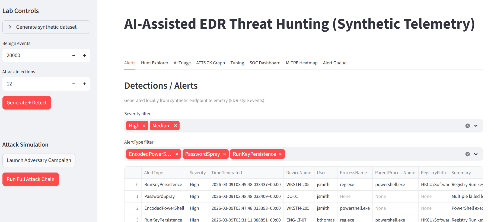
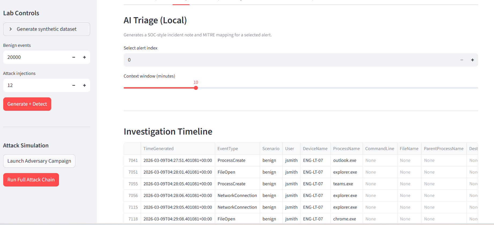
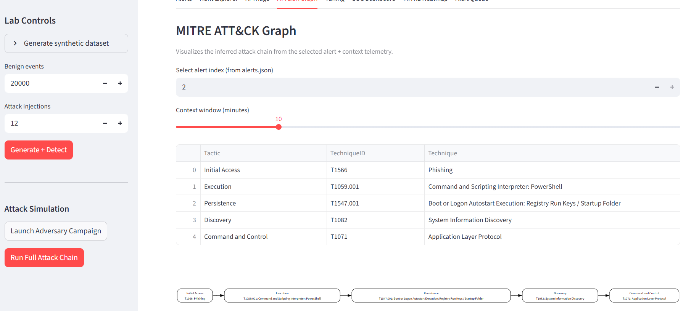
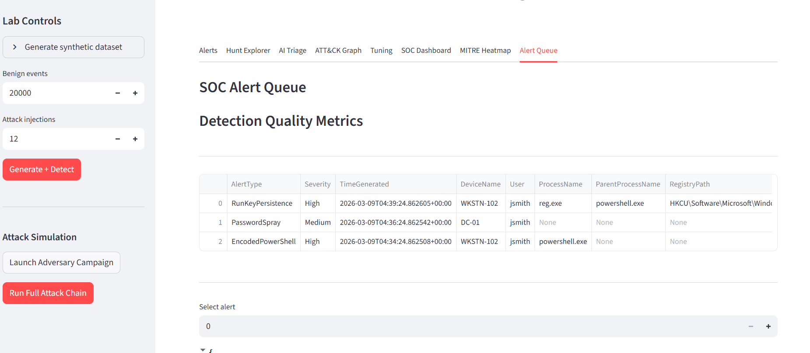

# AI-Assisted EDR Threat Hunting Lab

An AI-assisted SOC and detection engineering lab built in Python and Streamlit. This project simulates endpoint telemetry, generates adversary activity, applies custom detection rules, maps detections to MITRE ATT&CK, and provides a SOC-style dashboard for investigation, triage, and coverage analysis.

## Why I built this

I built this project to demonstrate practical blue-team and detection engineering skills in a hands-on environment. The goal was to create a mini SOC lab that shows how telemetry, detections, triage, ATT&CK mapping, analyst workflow, and coverage metrics fit together in an end-to-end security pipeline.

## Core capabilities

- Synthetic endpoint telemetry generation
- Adversary campaign simulation
- Custom detection rules for:
  - Encoded PowerShell
  - Password spraying
  - Run key persistence
  - Discovery activity
  - Command-and-control beaconing
  - Lateral movement
- Alert scoring and allowlist suppression
- MITRE ATT&CK enrichment and attack chain visualization
- Investigation timeline and event activity analysis
- SOC alert queue with analyst triage outcomes
- Detection coverage heatmap and coverage score
- AI-assisted SOC incident note generation

## Architecture

```text
Adversary Campaign Generator
        ↓
Synthetic Telemetry (events.jsonl)
        ↓
Detection Rules Engine
        ↓
Alert Scoring / Suppression
        ↓
ATT&CK Mapping
        ↓
SOC Dashboard (Streamlit)
        ↓
Investigation, Triage, Heatmap, Coverage Metrics

ai-edr-threat-hunting/
├── data/raw/events.jsonl
├── detections/
├── generator/
├── outputs/
├── streamlit_app/app.py
├── triage_ai/
├── docs/screenshots/
├── requirements.txt
└── README.md

MITRE ATT&CK coverage

This lab currently simulates and maps attacker activity across:

Initial Access

Execution

Discovery

Credential Access

Command and Control

Lateral Movement

Persistence

Example adversary chain

Phishing document opened

Encoded PowerShell execution

Local discovery activity

Password spray against domain resources

Command-and-control beacon

Lateral movement

Registry run key persistence

## Screenshots

### Alerts Dashboard


### Investigation Timeline


### ATT&CK Graph


### MITRE Heatmap


### Alert Queue


Add screenshots here after capture:

Alerts dashboard

Investigation timeline

ATT&CK graph

MITRE heatmap

Alert queue / analyst triage

How to run
1. Create and activate virtual environment
python -m venv venv
.\venv\Scripts\activate

2. Install dependencies
pip install -r requirements.txt

3. Generate attack activity and detections
python -c "from generator.campaign import generate_campaign; print(generate_campaign())"
python .\detections\rules.py

4. Run the dashboard
python -m streamlit run .\streamlit_app\app.py

What this project demonstrates

This project demonstrates practical skills in:

Detection engineering

Security telemetry analysis

SOC triage workflow

MITRE ATT&CK mapping

Investigation timeline analysis

Python-based security automation

Dashboard-driven security operations

AI-assisted cyber analysis

Future improvements

Additional ATT&CK techniques and detections

More realistic beaconing and lateral movement telemetry

Alert deduplication and correlation logic

Detection quality trending over time

Exportable reports and case management workflow

Author

Ryan Holmes
Security / Cyber / AI-focused portfolio project


---

# 3. Add a `requirements.txt`

Open:

```powershell
notepad .\requirements.txt

streamlit
pandas
matplotlib
plotly
